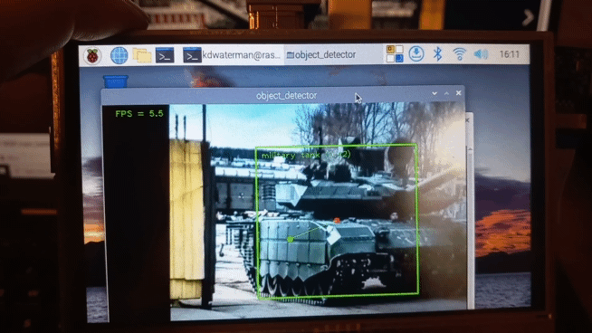

# TankNotTank

## Introduction
Welcome to TankNotTank! This project was the result of a simple curiosity - how easy would it be to train and deploy a tank finding algorithm on an edge computing device? This isn't a normal curiosity, admittedly, but watching FPV drones flying around Ukraine did make me think - how easy would it be to make these autonomously track tanks? This project doesn't quite go in to that detail, but it does provide a minimal proof-of-concept, complete with a trained model and the underlying training data. It should go without saying that this project is **strictly for educational purposes only**. 

As you will see, whilst it demonstrates an ability to accomplish the task in a basic sense, to get this right, reliable, and 'safe', would require a fair bit of extra effort. I've tested it on cars, trucks, and vans, but I'm a little short of tanks in my neighbourhood, however pointing it at images of them works well enough:



**EDIT - it turns out it works pretty well on real tanks. Altough it got a little confused with a Swedish S tank with its anti-HEAT screen up...**

This project draws very heavily on [tensorflow examples](https://github.com/tensorflow/examples/tree/master/lite/examples/object_detection/raspberry_pi). However it makes a number of subtle changes that resolve some compatability issues that appear to have arisen since the original tensorflow examples were published. Indeed, if you take a look at the latest comments in this [explainer video](https://www.youtube.com/watch?v=mNjXEybFn98&t=173s), you'll find most of the them from keen, but disappointed, hobbyists struggling to get the project working. Whilst these issues were not technically complex to fix, they were a pain to find, so at minimum I hope this might save someone else some time!

## Requirements
### Hardware 
To get started with TankNotTank, you will need the following hardware:

1. Either a Raspberry Pi Zero 2 W or a Raspberry Pi 4 
2. Raspberry Pi 5MP Camera 

Optionally, you may also want to add a touchscreen to make the setup portable. In this case, I'd recommend the `onboard` keyboard as opposed to the `matchbox-keyboard`, as is not optimally configured for the OS we will use. My setup looks like this:


It is worth noting that the Pi Zero runs rather a lot slower than the Pi 4, offering an average of ~2 FPS rather than ~5.5 FPS. However, the size differential between the two is considerable, which means the Pi Zero would probably be a better choice for a companion computer on a drone. 

### OS 
This project uses the legacy 32-bit Raspberry Pi OS, Debian Bullseye. The latest OS, Bookworm, appears to have a whole host of compatability issues with the required Python packages, as well as with the main camera application software used by Raspberry Pi OS. Reverting to this legacy, 32-bit OS resolved all of these issues for me. 

## Getting Setup
If you've worked with the tensorflow examples before, the setup below will be familiar, but it is worth noting the 'libatlas-base-dev' install. This was not in the original instructional video I used to begin this project, so it led me astray for little while whilst I figured it out. In essence, libatlas is a linear algebra library which is integral to the machine learning functionality being deployed, and missing from default Raspberry Pi OS builds.  


```
sudo apt-get update
sudo apt-get upgrade
sudo apt-get install libatlas-base-dev

python3 -m pip install --upgrade pip
python3 -m pip install virtual env


```

Next we make a virtual environment in which to clone the repo and install the required python packages. 

```
python3 -m venv tnt
source tnt/bin/activate
git clone https://github.com/kdwaterman/TankNotTank.git
cd TankNotTank
sh setup.sh

```

There is a small chance this might not work, and if it doesn't you'll need to install each dependency separately. In the original tensorflow example I had to make some changes to the requirements in order to get all the dependencies to sync up. For reference, here is the original compared to what is in this project. 

| Current      | Original |
|:----|:----|
| `argparse`      | `argparse`    |
| `numpy==1.20.0`    | `numpy>=1.20.0 `      |
| `opencv-python==4.5.3.56 `    | `opencv-python~=4.5.3.56  `   |
| `tflite-support==0.4.3 `  | `tflite-support>=0.4.2  `   |
| `protobuf>=3.18.0,<4 `| `protobuf>=3.18.0,<4 `  |

## Getting The Model Running
So, now you have everything downloaded, how do we get the `TankNotTank.tflite` model running? Unsurprisingly for a Pi project, it begins with a further bit of configuration. In this case, we need to enable the legacy camera module. This can be done via `raspi-config` and following the relevant menu options. Now we're ready to actually use the model. Thankfully, this is the simple bit, and can be accomplished by running the following command in the TankNotTank directory:

```
python3 detect.py --model TankNotTank.tflite
```

If everything works, this should start up a new window with our camera output. If pointed at something vaguely related to the classes listed below, a bounding box with class name and probability of match should appear. You'll note I've also added a small extra bit of functionality which marks the center of the detected object and the center of the camera's field-of-view, with a link between them. This doesn't serve a real purpose, but it lays some groundwork for extra functionality I may get around to adding. Similarly, it should also provide others with an easy starting point too. 

## Training Your Own Model
To train your own tank detecting model, you'll need to use your laptop, rather than the Pi. For the `TankNotTank.tflite` model I used this [Colab Notebook](https://colab.research.google.com/github/EdjeElectronics/TensorFlow-Lite-Object-Detection-on-Android-and-Raspberry-Pi/blob/master/Train_TFLite2_Object_Detction_Model.ipynb) put together by *EdjeElectronics* (if you haven't checked out [their stuff](https://github.com/EdjeElectronics), you should, it's great). Essentially, the notebook takes a copy of the `ssd-mobilenet-v2-fpnlite-320` model and fine tunes it to your uploaded dataset. The training data I used can be found [here](https://data.mendeley.com/datasets/njdjkbxdpn/1), but it required a little manipulation and cleaning before I could use it properly, so my folder structure, and some of the data, differs from the original subtlety. This data may not be perfect, but it did the job, and was very kindly made public by the paper's authors.[^1] 

The data has the following object classes:

| Class              |
|:---                |
| civilian aircraft  | 
| civilian car       |
| military aircraft  | 
| military helicopter| 
| military tank      | 
| military truck     | 

As this is a proof-of-concept, I only trained my model on free GPU time provided by Colab, so there is plenty of room for refinement. The end product is a quantized object detection model that does a pretty good job of classifying objects. However, as with many simple, quantized models, it makes some pretty dramatic mistakes and is easy to spoof. So, enjoy! But don't be surprised when your face is occasionally mistaken for an airliner... 

### Configuring Our New Model
As you may have guessed, it is now time for some extra configuration. In our case, it transpires that the process above does not produce a model with the metadata required by the specific OpenCV implementation used. However, this is easy to rectify, and all it requires is the latest version of `tflite-support`. Aside from that, it is straightforward:

1. Take a copy of the [metadata](/metadata) folder from this project and place the `TankNotTank.tflite` model within it.
2. Update `add_metadata.py` to edit in your own model name
3. Call `python3 add_metadata.py`

This will add the relevant metadata to the `.tflite` model you've trained, and it should now be ready to transfer to the Pi for use. Just place it in the main working directory and run the following:

```
python3 detect.py --model <YourModelNameHere>.tflite
```


[^1]: Gupta, Priyanka; Pareek, Bhavya; Singal, Gaurav; Rao, D Vijay (2021), “Military and Civilian Vehicles Classification”, Mendeley Data, V1, doi: 10.17632/njdjkbxdpn.1
